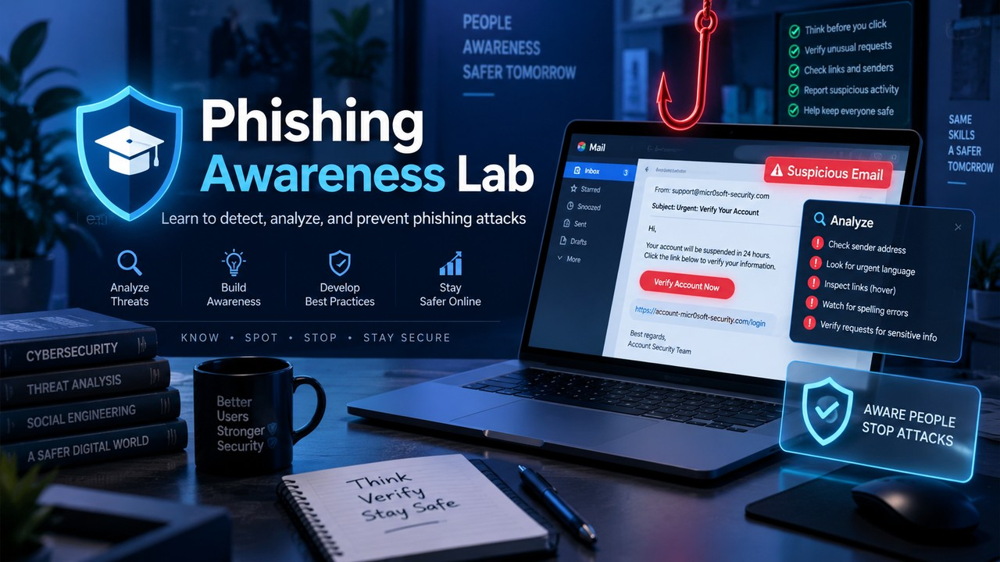

<div align="center">


# 🎣 Phishing Awareness Lab

**A controlled, self-targeted phishing simulation — built to be *studied from the defender's side*.**

Set up a real campaign with [Gophish](https://getgophish.com/), fire it at your own inbox,
then dissect exactly why it did (or didn't) land — SPF, DKIM, DMARC and header forensics.

<br>


</div>

---

> [!WARNING]
> **Scope & ethics — read first.** This lab is **only ever** run against the
> author's own mailbox, on the author's own machine, with nothing exposed to the
> internet. Sending a phishing message to anyone else — even as a prank — without
> written authorisation is a crime (🇮🇪 *Criminal Justice (Offences Relating to
> Information Systems) Act 2017*; 🇧🇷 *Lei 14.155/2021*). The skill that gets you
> hired is doing this **safely and in scope** — that is the whole point of the lab.

## 📑 Contents

- [Why this project](#-why-this-project)
- [Architecture](#-architecture)
- [What's in the repo](#-whats-in-the-repo)
- [Quick start](#-quick-start)
- [The learning goal](#-the-learning-goal)
- [License](#-license)

## 💡 Why this project

Phishing is still the **number-one initial-access vector** in real breaches. The
most honest way to learn to *defend* against it is to build one in a sealed
environment and take it apart. This repo does that end-to-end:

- 🧰 **Build** — a full Gophish campaign: sending profile, lure, cloned landing page, tracking.
- 🎯 **Scope** — a single consenting target (me), everything on `127.0.0.1`.
- 🛡️ **Analyse** — read the email's authentication results and map each weakness to a real control.
- 🔁 **Connect** — ties into a real DMARC rollout across three live domains behind Cloudflare.

## 🏗️ Architecture

```
            ┌──────────────────────────────────────────────┐
            │              your machine (localhost)         │
            │                                               │
  Gophish   │   ┌─────────┐   lure email    ┌───────────┐   │
  admin ────┼──▶│ Gophish │────────────────▶│  MailHog  │   │
  :3333     │   │ server  │                 │   :1025   │   │
            │   └────┬────┘                 └─────┬─────┘   │
            │        │ tracked link               │ web UI  │
            │        ▼                             ▼         │
            │   ┌──────────┐              http://127.0.0.1:8025
            │   │ landing/ │  ← you click → event is logged →
            │   │ reveal   │    "this was a test" page is shown
            │   └──────────┘                                │
            └──────────────────────────────────────────────┘
```

Two sending modes are documented:

| Mode | What it does | Credentials | Blast radius |
|---|---|---|---|
| **MailHog** *(default)* | Catches mail locally, read it in a browser | none | zero — nothing leaves the PC |
| **Real Gmail SMTP** *(optional)* | Watch the lure hit a real inbox, inspect real SPF/DKIM/DMARC | Google **app password** (never the real one) | one inbox: mine |

## 📂 What's in the repo

```
phishing-awareness-lab/
├── README.md
├── LICENSE                          # MIT
├── .gitignore                       # keeps the Gophish binary & DB out of git
├── docs/
│   ├── 01-setup.md                  # install Gophish + local mail catcher
│   ├── 02-run-a-campaign.md         # template → landing → group → launch
│   └── 03-defensive-analysis.md     # ⭐ why it worked / how to stop it
├── templates/
│   ├── email-confirm-account.html   # the lure (import into Gophish)
│   └── landing-awareness.html       # the "this was a test" reveal page
└── analysis/
    └── email-auth-checklist.md      # SPF / DKIM / DMARC reading guide
```

## 🚀 Quick start

```powershell
# 1. download Gophish v0.12.1  (verified link + hash in docs/01-setup.md)
# 2. from this folder:
.\gophish.exe
# 3. copy the one-time admin password printed in the console
# 4. open https://127.0.0.1:3333   (self-signed cert warning is expected)
```

Full walkthrough → **[docs/01-setup.md](docs/01-setup.md)** then
**[docs/02-run-a-campaign.md](docs/02-run-a-campaign.md)**.

## 🎓 The learning goal

Building the campaign is 20% of the value. The portfolio payoff is the
**defensive write-up** in [docs/03-defensive-analysis.md](docs/03-defensive-analysis.md):

- How a forged **display name** hides a non-matching sending address — the whole social-engineering surface.
- What the received message's `Authentication-Results` header reveals (`spf=`, `dkim=`, `dmarc=`) and *why*.
- Mapping each weakness to a concrete control — ending at **DMARC `p=reject`**, which turns a delivered spoof into one *refused at the gateway*.

> 🔗 This pairs with a real deployment: DMARC was reviewed and hardened across
> three live domains (`radarrider.com`, `mykeymate.com`, `br-deals.com`) behind
> Cloudflare — see the worked example in
> [analysis/email-auth-checklist.md](analysis/email-auth-checklist.md).

📄 A full defensive write-up template, pre-filled with that real DMARC rollout,
lives in **[analysis/sample-findings.md](analysis/sample-findings.md)** — adapt
it with your own campaign numbers after a run.

## 📝 License

[MIT](LICENSE) — educational and defensive use only, within the scope above.

<div align="center"><sub>Built as a security-awareness portfolio project.</sub></div>
